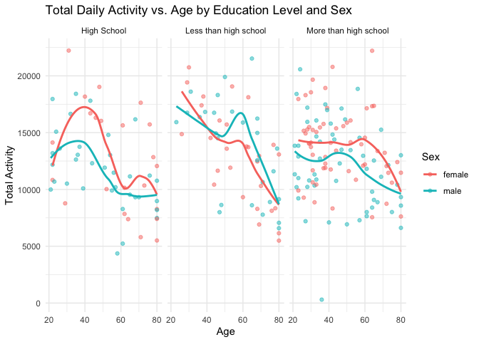
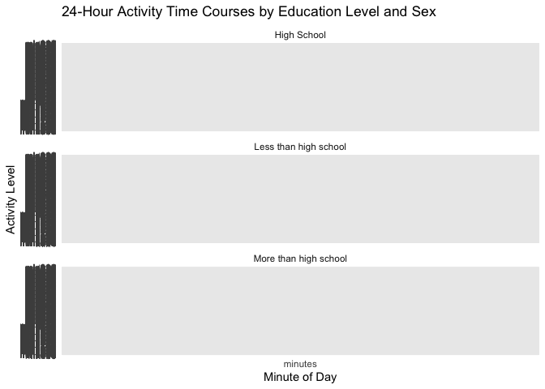
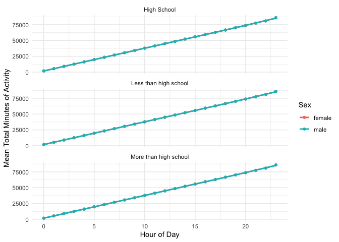
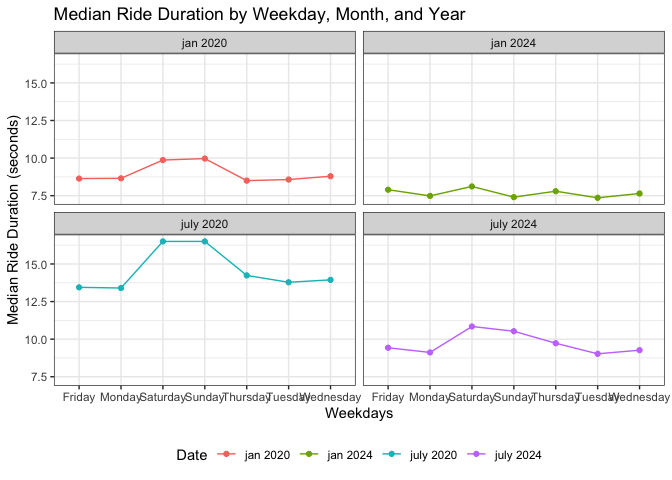
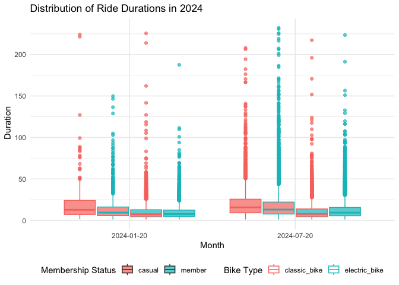

P8105 HW3
================
2024-10-09

``` r
library(p8105.datasets)
data("ny_noaa")
```

## Problem 1

``` r
ny_noaa_updated = 
  (ny_noaa %>%
mutate(
    date = as.Date(date),
    year = year(date),
    month = month(date),
    day = day(date),  
    tmax = as.numeric(tmax),
    tmin = as.numeric(tmin),
    prcp = as.numeric(prcp),
    snow = as.numeric(snow)))
```

In the ny_noaa dataset, we observe weather patterns (precipation,
snowfall, snow depth) from numerous stations in New York. The variables
identified are: (station) id, date, tmax (max temp in F), tmin (min temp
in F), prcp (precipation), and snow (fall). The most commonly observed
snowfall values are 0 or NA indicating that there is a large majority of
stations that do not have snowfall.

``` r
snowfall_values <- ny_noaa_updated %>%
  group_by(snow) %>%
  summarise(count = n()) %>%
  arrange(desc(count))

print(snowfall_values)
```

    ## # A tibble: 282 × 2
    ##     snow   count
    ##    <dbl>   <int>
    ##  1     0 2008508
    ##  2    NA  381221
    ##  3    25   31022
    ##  4    13   23095
    ##  5    51   18274
    ##  6    76   10173
    ##  7     8    9962
    ##  8     5    9748
    ##  9    38    9197
    ## 10     3    8790
    ## # ℹ 272 more rows

``` r
temp_station = ny_noaa_updated %>%
  mutate(month = case_when(
    id == "January" ~ "January",
    id == "July" ~ "July",
    TRUE ~ NA_character_  
  )) 

print(temp_station)
```

    ## # A tibble: 2,595,176 × 10
    ##    id          date        prcp  snow  snwd  tmax  tmin  year month   day
    ##    <chr>       <date>     <dbl> <dbl> <int> <dbl> <dbl> <dbl> <chr> <int>
    ##  1 US1NYAB0001 2007-11-01    NA    NA    NA    NA    NA  2007 <NA>      1
    ##  2 US1NYAB0001 2007-11-02    NA    NA    NA    NA    NA  2007 <NA>      2
    ##  3 US1NYAB0001 2007-11-03    NA    NA    NA    NA    NA  2007 <NA>      3
    ##  4 US1NYAB0001 2007-11-04    NA    NA    NA    NA    NA  2007 <NA>      4
    ##  5 US1NYAB0001 2007-11-05    NA    NA    NA    NA    NA  2007 <NA>      5
    ##  6 US1NYAB0001 2007-11-06    NA    NA    NA    NA    NA  2007 <NA>      6
    ##  7 US1NYAB0001 2007-11-07    NA    NA    NA    NA    NA  2007 <NA>      7
    ##  8 US1NYAB0001 2007-11-08    NA    NA    NA    NA    NA  2007 <NA>      8
    ##  9 US1NYAB0001 2007-11-09    NA    NA    NA    NA    NA  2007 <NA>      9
    ## 10 US1NYAB0001 2007-11-10    NA    NA    NA    NA    NA  2007 <NA>     10
    ## # ℹ 2,595,166 more rows

## Problem 2

``` r
library(tidyverse)
library(haven)
library(janitor)
library(dplyr)

covar_df <- read_csv("./data/nhanes_covar.csv")
```

    ## Rows: 250 Columns: 5
    ## ── Column specification ────────────────────────────────────────────────────────
    ## Delimiter: ","
    ## dbl (5): SEQN, sex, age, BMI, education
    ## 
    ## ℹ Use `spec()` to retrieve the full column specification for this data.
    ## ℹ Specify the column types or set `show_col_types = FALSE` to quiet this message.

``` r
accel_df <- read_csv("./data/nhanes_accel.csv")
```

    ## Rows: 250 Columns: 1441
    ## ── Column specification ────────────────────────────────────────────────────────
    ## Delimiter: ","
    ## dbl (1441): SEQN, min1, min2, min3, min4, min5, min6, min7, min8, min9, min1...
    ## 
    ## ℹ Use `spec()` to retrieve the full column specification for this data.
    ## ℹ Specify the column types or set `show_col_types = FALSE` to quiet this message.

``` r
colnames(covar_df) <- c("SEQN", "sex", "age", "BMI", "education")

covar_df <- covar_df |>
  clean_names()

accel_df <- accel_df |> 
  clean_names()
```

``` r
covar_df <- covar_df |>
  filter(age >= 21) |>
  drop_na() |>
  mutate(
    sex = 
      case_match(
        sex, 
        1 ~ "male", 
        2 ~ "female"),
    sex = as.factor(sex),
    education= 
      case_match(
        education, 
        1 ~ "Less than high school", 
        2 ~ "High School",
        3 ~ "More than high school"), 
    education = as.factor(education))

accel_df <- accel_df |>
  drop_na()

accel_df = 
  pivot_longer(
    accel_df, 
    starts_with("min"),
    names_to = "minutes", 
    values_to = "min",
    names_prefix = "min")

covar_accel_df = 
  left_join(covar_df, accel_df, by = "seqn")

print(covar_accel_df)
```

    ## # A tibble: 328,320 × 7
    ##     seqn sex     age   bmi education   minutes   min
    ##    <dbl> <fct> <dbl> <dbl> <fct>       <chr>   <dbl>
    ##  1 62161 male     22  23.3 High School 1       1.11 
    ##  2 62161 male     22  23.3 High School 2       3.12 
    ##  3 62161 male     22  23.3 High School 3       1.47 
    ##  4 62161 male     22  23.3 High School 4       0.938
    ##  5 62161 male     22  23.3 High School 5       1.60 
    ##  6 62161 male     22  23.3 High School 6       0.145
    ##  7 62161 male     22  23.3 High School 7       2.10 
    ##  8 62161 male     22  23.3 High School 8       0.509
    ##  9 62161 male     22  23.3 High School 9       1.63 
    ## 10 62161 male     22  23.3 High School 10      1.20 
    ## # ℹ 328,310 more rows

For this problem, I used the clean_names function to tidy the data and
began to filter the age for the covar_df less than 21 years of age. One
thing to note that I am missing in my code is the skip 4 lines function.
I did not do this because I had already removed the first 4 rows when I
loaded the data into the project. I spoke with someone during office
hours and they strongly advised me to not do that for future assignments
as I might get deducted points. Hopefully, this clarifies a bit of my
work.

Additionally, I used case_match to sort through the numeric values
representing sex to characters. For the accel_df, I used the
pivot_longer tool to combine all the columns representing minutes. After
that, I combined the two datasets together.

``` r
covar_accel_df |>
  group_by(education, sex) |>
  summarize(count = n()) |>
  pivot_wider(names_from = sex, values_from = count) |>
  knitr::kable()
```

    ## `summarise()` has grouped output by 'education'. You can override using the
    ## `.groups` argument.

| education             | female |  male |
|:----------------------|-------:|------:|
| High School           |  33120 | 50400 |
| Less than high school |  40320 | 38880 |
| More than high school |  84960 | 80640 |

``` r
library(ggridges)

ggplot(covar_accel_df, aes(x = age, fill = sex)) + 
  geom_histogram(binwidth = 5, position = "dodge") + 
  facet_wrap(~ education) +
  labs(title = "Age Distribution by Education Level and Sex", 
       x = "Age", 
       y = "People",
       fill = "Sex") +
  theme_minimal()
```

<!-- -->

## Graph 1

This graph showcases age distribution within each education level: high
school, less than high school and more than high school. It compares the
difference between two sexes: male and female. Upon observation, we can
see that there is an increase of females who pursue education more than
high school from the age range 25-35.

``` r
activity_df = covar_accel_df |> 
  group_by(seqn) |> 
  summarize(total_activity = sum(min, na.rm = TRUE))

activity_demo_df = left_join(covar_df, activity_df, by = "seqn")

ggplot(activity_demo_df, aes(x = age, y = total_activity, color = sex)) +
  geom_point(alpha = 0.5) + 
  geom_smooth(method = "loess", se = FALSE) +
  facet_wrap(~ education) + 
  labs(title = "Total Daily Activity vs. Age by Education Level and Sex",
       x = "Age", 
       y = "Total Activity", 
       color = "Sex") +
  theme_minimal()
```

    ## `geom_smooth()` using formula = 'y ~ x'

<!-- -->
\## Graph 2

This graph depicts accelerometer data by education level and sex. Total
activity is representing the accelerometer data that we used earlier.
From these visualizations, we can see that females have a peak total
activity during high school whereas for both sexes, the activity level
begans to decrease with age.

``` r
library(dplyr)

covar_accel_activity <- covar_accel_df %>%
  mutate(minutes = as.numeric(as.character(minutes)), 
         hour = floor(minutes / 60), 
         hour = ifelse(hour > 23, 23, hour)) %>% 
  group_by(seqn, sex, education, hour) %>% 
  summarize(total_minutes = sum(minutes, na.rm = TRUE), .groups = "drop")

covar_accel_activity |>
  group_by(education, sex, hour) |>
  summarize(mean_total_minutes = mean(total_minutes, na.rm = TRUE), 
            .groups = "drop") |>
  ggplot(aes(x = hour, y = mean_total_minutes, color = sex)) +
  geom_point() +
  geom_smooth(se = FALSE) +
  facet_wrap(~ education, nrow = 3) +
  labs(
    x = "Hour of Day",
    y = "Mean Total Minutes of Activity",
    color = "Sex"
  ) +
  theme_minimal() 
```

    ## `geom_smooth()` using method = 'loess' and formula = 'y ~ x'

<!-- -->
This graph took a bit of time to make but essentially I converted the
minutes to hour of day to showcase a better visualization when plotting
the data.

## Problem 3

``` r
library(tidyverse)
library(readr) 
library(lubridate) 

jan_2020_citibike = 
  read_csv("citibike/Jan 2020 Citi.csv", show_col_types = FALSE) |>
  clean_names() |>
  drop_na() |>
  mutate(Date = "jan 2020")

july_2020_citibike = 
  read_csv("citibike/July 2020 Citi.csv", show_col_types = FALSE) |>
  clean_names() |>
  drop_na() |>
  mutate(Date = "july 2020")

jan_2024_citibike = 
  read_csv("citibike/Jan 2024 Citi.csv", show_col_types = FALSE) |>
  clean_names() |>
  drop_na() |>
  mutate(Date = "jan 2024")

july_2024_citibike = 
  read_csv("citibike/July 2024 Citi.csv", show_col_types = FALSE) |>
  clean_names() |>
  drop_na() |>
  mutate(Date = "july 2024")

citibike_df <- bind_rows(
  jan_2020_citibike, 
  july_2020_citibike, 
  jan_2024_citibike, 
  july_2024_citibike)

citibike_df <- citibike_df %>% 
  filter(duration <= 4 * 60 * 60)

ride_summary <- citibike_df %>% 
  group_by(Date, member_casual) %>% 
  summarize(total_rides = n(), .groups = "drop") %>% 
  pivot_wider(names_from = member_casual, values_from = total_rides) %>% 
  arrange(Date)

knitr::kable(ride_summary, 
             col.names = c("Date", "Casual Riders", "Citi Bike Members"),
             caption = "Total Number of Citi Bike Rides by Year and Month")
```

| Date      | Casual Riders | Citi Bike Members |
|:----------|--------------:|------------------:|
| jan 2020  |           980 |             11418 |
| jan 2024  |          2094 |             16705 |
| july 2020 |          5625 |             15388 |
| july 2024 |         10843 |             36200 |

Total Number of Citi Bike Rides by Year and Month

This table reveals the breakdown between casual riders versus members
within the following time periods: Jan 2024, Jan 2020, july 2020, and
july 2024. To get to this, I had to extract all the csv files from the
citibike folder, tidied the data, and labeled with the corresponding
date. Then, I combined all of them together by bind_rows and then
filtered by converting 4 hours to seconds. I then ended up with this
result.

``` r
july_2024_starts <- citibike_df %>% 
  filter(Date == "july 2024") %>% 
  group_by(start_station_name) %>% 
  summarize(ride_count = n()) %>% 
  arrange(desc(ride_count)) %>% 
  slice_head(n = 5)

knitr::kable(july_2024_starts, 
             col.names = c("Start Station", "Number of Rides"),
             caption = "Top 5 Citi Bike Start Stations in July 2024")
```

| Start Station            | Number of Rides |
|:-------------------------|----------------:|
| Pier 61 at Chelsea Piers |             163 |
| University Pl & E 14 St  |             155 |
| W 21 St & 6 Ave          |             152 |
| West St & Chambers St    |             150 |
| W 31 St & 7 Ave          |             145 |

Top 5 Citi Bike Start Stations in July 2024

``` r
median_ride_duration <- citibike_df %>% 
  group_by(Date, weekdays) %>% 
  summarize(median_duration = median(duration, na.rm = TRUE), .groups = "drop")

ggplot(median_ride_duration, aes(x = weekdays, y = median_duration, color = Date)) +
  geom_point() +
  geom_line(aes(group = Date)) +
  facet_wrap(~Date, ncol = 2) +
  labs(title = "Median Ride Duration by Weekday, Month, and Year",
       x = "Weekdays",
       y = "Median Ride Duration (seconds)",
       color = "Date") +
  theme_bw() +
  theme(legend.position = "bottom")
```

<!-- -->
From my observations, we can see that in Jan 2024, the median ride
duration was lower compared to the other time periods. This can be due
to colder weather. We can also emphasize that July 2020 had the highest
median ride duration from all of the others.

``` r
citibike_df_2024 <- citibike_df %>%
  mutate(Date = mdy(Date)) %>% 
  filter(year(Date) == 2024) %>% 
  separate(Date, into = c("month", "year"), sep = " ", convert = TRUE) 
```

    ## Warning: Expected 2 pieces. Missing pieces filled with `NA` in 65842 rows [1, 2, 3, 4,
    ## 5, 6, 7, 8, 9, 10, 11, 12, 13, 14, 15, 16, 17, 18, 19, 20, ...].

``` r
ggplot(citibike_df_2024, aes(x = month, y = duration, fill = member_casual, color = rideable_type)) +
  geom_boxplot(position = position_dodge(width = 0.8), alpha = 0.7) +
  labs(title = "Distribution of Ride Durations in 2024",
       x = "Month",
       y = " Duration",
       fill = "Membership Status",
       color = "Bike Type") +
  theme_minimal() +
  theme(legend.position = "bottom") 
```

<!-- -->
The findings of this boxplot reveal that ride duration on electric bikes
in July 2024 among members was the highest. We can observe that there
was a greater amount of casual riders in July as well.
