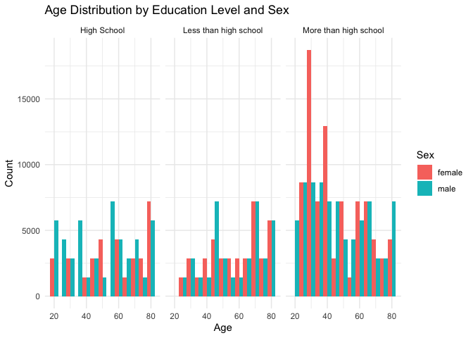

P8105 HW3
================
2024-10-09

``` r
library(p8105.datasets)
data("ny_noaa")
```

## Problem 1

``` r
ny_noaa_updated = 
  (ny_noaa %>%
mutate(
    date = as.Date(date),
    year = year(date),
    month = month(date),
    day = day(date),  
    tmax = as.numeric(tmax),
    tmin = as.numeric(tmin),
    prcp = as.numeric(prcp),
    snow = as.numeric(snow)))
```

In the ny_noaa dataset, we observe weather patterns (precipation,
snowfall, snow depth) from numerous stations in New York. The variables
identified are: (station) id, date, tmax (max temp in F), tmin (min temp
in F), prcp (precipation), and snow (fall). The most commonly observed
snowfall values are 0 or NA indicating that there is a large majority of
stations that do not have snowfall.

``` r
snowfall_values <- ny_noaa_updated %>%
  group_by(snow) %>%
  summarise(count = n()) %>%
  arrange(desc(count))

print(snowfall_values)
```

    ## # A tibble: 282 × 2
    ##     snow   count
    ##    <dbl>   <int>
    ##  1     0 2008508
    ##  2    NA  381221
    ##  3    25   31022
    ##  4    13   23095
    ##  5    51   18274
    ##  6    76   10173
    ##  7     8    9962
    ##  8     5    9748
    ##  9    38    9197
    ## 10     3    8790
    ## # ℹ 272 more rows

``` r
temp_station = ny_noaa_updated %>%
  mutate(month = case_when(
    id == "January" ~ "January",
    id == "July" ~ "July",
    TRUE ~ NA_character_  
  )) 

print(temp_station)
```

    ## # A tibble: 2,595,176 × 10
    ##    id          date        prcp  snow  snwd  tmax  tmin  year month   day
    ##    <chr>       <date>     <dbl> <dbl> <int> <dbl> <dbl> <dbl> <chr> <int>
    ##  1 US1NYAB0001 2007-11-01    NA    NA    NA    NA    NA  2007 <NA>      1
    ##  2 US1NYAB0001 2007-11-02    NA    NA    NA    NA    NA  2007 <NA>      2
    ##  3 US1NYAB0001 2007-11-03    NA    NA    NA    NA    NA  2007 <NA>      3
    ##  4 US1NYAB0001 2007-11-04    NA    NA    NA    NA    NA  2007 <NA>      4
    ##  5 US1NYAB0001 2007-11-05    NA    NA    NA    NA    NA  2007 <NA>      5
    ##  6 US1NYAB0001 2007-11-06    NA    NA    NA    NA    NA  2007 <NA>      6
    ##  7 US1NYAB0001 2007-11-07    NA    NA    NA    NA    NA  2007 <NA>      7
    ##  8 US1NYAB0001 2007-11-08    NA    NA    NA    NA    NA  2007 <NA>      8
    ##  9 US1NYAB0001 2007-11-09    NA    NA    NA    NA    NA  2007 <NA>      9
    ## 10 US1NYAB0001 2007-11-10    NA    NA    NA    NA    NA  2007 <NA>     10
    ## # ℹ 2,595,166 more rows

## Problem 2

``` r
library(tidyverse)
library(haven)
library(janitor)
library(dplyr)

covar_df <- read_csv("./data/nhanes_covar.csv")
```

    ## Rows: 250 Columns: 5
    ## ── Column specification ────────────────────────────────────────────────────────
    ## Delimiter: ","
    ## dbl (5): SEQN, sex, age, BMI, education
    ## 
    ## ℹ Use `spec()` to retrieve the full column specification for this data.
    ## ℹ Specify the column types or set `show_col_types = FALSE` to quiet this message.

``` r
accel_df <- read_csv("./data/nhanes_accel.csv")
```

    ## Rows: 250 Columns: 1441
    ## ── Column specification ────────────────────────────────────────────────────────
    ## Delimiter: ","
    ## dbl (1441): SEQN, min1, min2, min3, min4, min5, min6, min7, min8, min9, min1...
    ## 
    ## ℹ Use `spec()` to retrieve the full column specification for this data.
    ## ℹ Specify the column types or set `show_col_types = FALSE` to quiet this message.

``` r
colnames(covar_df) <- c("SEQN", "sex", "age", "BMI", "education")

covar_df <- covar_df |>
  clean_names()

accel_df <- accel_df |> 
  clean_names()
```

``` r
covar_df <- covar_df |>
  filter(age >= 21) |>
  drop_na() |>
  mutate(
    sex = 
      case_match(
        sex, 
        1 ~ "male", 
        2 ~ "female"),
    sex = as.factor(sex),
    education= 
      case_match(
        education, 
        1 ~ "Less than high school", 
        2 ~ "High School",
        3 ~ "More than high school"), 
    education = as.factor(education))

accel_df <- accel_df |>
  drop_na()

accel_df = 
  pivot_longer(
    accel_df, 
    starts_with("min"),
    names_to = "minutes", 
    values_to = "min")

covar_accel_df = 
  left_join(covar_df, accel_df, by = "seqn")

print(covar_accel_df)
```

    ## # A tibble: 328,320 × 7
    ##     seqn sex     age   bmi education   minutes   min
    ##    <dbl> <fct> <dbl> <dbl> <fct>       <chr>   <dbl>
    ##  1 62161 male     22  23.3 High School min1    1.11 
    ##  2 62161 male     22  23.3 High School min2    3.12 
    ##  3 62161 male     22  23.3 High School min3    1.47 
    ##  4 62161 male     22  23.3 High School min4    0.938
    ##  5 62161 male     22  23.3 High School min5    1.60 
    ##  6 62161 male     22  23.3 High School min6    0.145
    ##  7 62161 male     22  23.3 High School min7    2.10 
    ##  8 62161 male     22  23.3 High School min8    0.509
    ##  9 62161 male     22  23.3 High School min9    1.63 
    ## 10 62161 male     22  23.3 High School min10   1.20 
    ## # ℹ 328,310 more rows

For this problem, I used the clean_names function to tidy the data and
began to filter the age for the covar_df less than 21 years of age. One
thing to note that I am missing in my code is the skip 4 lines function.
I did not do this because I had already removed the first 4 rows when I
loaded the data into the project. I spoke with someone during office
hours and they strongly advised me to not do that for future assignments
as I might get deducted points. Hopefully, this clarifies a bit of my
work.

Additionally, I used case_match to sort through the numeric values
representing sex to characters. For the accel_df, I used the
pivot_longer tool to combine all the columns representing minutes. After
that, I combined the two datasets together.

``` r
library(ggridges)

ggplot(covar_accel_df, aes(x = age, fill = sex)) + 
  geom_histogram(binwidth = 5, position = "dodge") + 
  facet_wrap(~ education) +
  labs(title = "Age Distribution by Education Level and Sex", 
       x = "Age", 
       y = "Count",
       fill = "Sex") +
  theme_minimal()
```

<!-- -->

## Problem 3

``` r
jan_2020_citibike = 
  read_csv("citibike/Jan 2020 Citi.csv", show_col_types = FALSE) |>
  clean_names() |>
  drop_na() 
```
